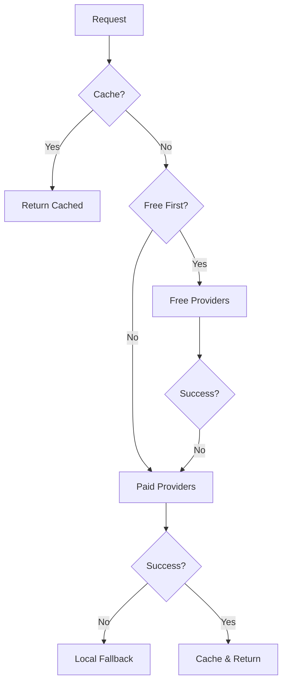

# AI Providers Configuration Guide

## Table of Contents
1. [Overview](#overview)
2. [Provider Types](#provider-types)
3. [Configuration Setup](#configuration-setup)
4. [Free Providers](#free-providers)
5. [Paid Providers](#paid-providers)
6. [Fallback System](#fallback-system)
7. [Caching System](#caching-system)
8. [Troubleshooting](#troubleshooting)

## Overview

The Code Muse Board application supports multiple AI providers with an intelligent fallback system. This includes both free and paid providers, with options for local processing and cloud-based services.

### Architecture


## Provider Types

### Free Providers
1. **Hugging Face (Free Tier)**
   - Open-source models
   - No credit card required
   - Rate-limited access

2. **Ollama (Local)**
   - Runs on your machine
   - No usage limits
   - Complete privacy
   - Supports Llama 2 and other models

3. **Local Transformers**
   - Built-in Node.js support
   - Offline capable
   - CPU-optimized models

### Paid Providers
1. **OpenAI**
   - Multiple API key support
   - Automatic key rotation
   - Usage-based billing

2. **Anthropic (Claude)**
   - Alternative to OpenAI
   - Different pricing model
   - High-quality results

3. **Cohere**
   - Specialized in text analysis
   - Alternative pricing structure

## Configuration Setup

### Basic Configuration
Create a `.env` file based on the template:

```env
# Free Providers Configuration
USE_FREE_PROVIDERS_FIRST=true
USE_LOCAL_MODELS=true

# Hugging Face
HUGGINGFACE_API_KEY=your-free-tier-key

# Ollama Configuration
OLLAMA_ENDPOINT=http://localhost:11434/api/generate
USE_OLLAMA=true

# Local Models
LOCAL_MODELS_CACHE_DIR=./models

# Paid Providers (Optional)
OPENAI_API_KEYS=key1,key2,key3
ANTHROPIC_API_KEY=your-anthropic-key
COHERE_API_KEY=your-cohere-key

# General Settings
CACHE_DURATION=3600
USE_ALTERNATIVE_PROVIDERS=true
```

### Provider Priority Setup
```javascript
{
  "providerPriority": {
    "free": ["ollama", "huggingface", "local"],
    "paid": ["openai", "anthropic", "cohere"]
  }
}
```

## Free Providers

### Hugging Face Setup
1. Create account at [Hugging Face](https://huggingface.co/)
2. Get API key from settings
3. Add to `.env`: `HUGGINGFACE_API_KEY=your-key`

### Ollama Setup
1. Install Ollama:
   ```bash
   # Windows
   winget install Ollama

   # macOS
   brew install ollama

   # Linux
   curl -fsSL https://ollama.ai/install.sh | sh
   ```

2. Start Ollama service:
   ```bash
   ollama serve
   ```

3. Pull required models:
   ```bash
   ollama pull llama2
   ```

### Local Transformers Setup
No additional setup required. Models are downloaded automatically when needed.

## Paid Providers

### OpenAI Setup
1. Get API key(s) from [OpenAI Platform](https://platform.openai.com)
2. Add to `.env`: `OPENAI_API_KEYS=key1,key2,key3`

### Anthropic Setup
1. Get API key from Anthropic
2. Add to `.env`: `ANTHROPIC_API_KEY=your-key`

### Cohere Setup
1. Get API key from Cohere
2. Add to `.env`: `COHERE_API_KEY=your-key`

## Fallback System

The system uses a cascading fallback approach:

1. Check cache first
2. Try free providers (if enabled)
3. Try paid providers
4. Use local fallback analysis

### Fallback Order
```javascript
try {
  // 1. Check cache
  const cached = await checkCache();
  if (cached) return cached;

  // 2. Try free providers
  if (USE_FREE_PROVIDERS_FIRST) {
    const freeResult = await tryFreeProviders();
    if (freeResult) return freeResult;
  }

  // 3. Try paid providers
  const paidResult = await tryPaidProviders();
  if (paidResult) return paidResult;

  // 4. Local fallback
  return generateLocalAnalysis();
} catch (error) {
  return handleError(error);
}
```

## Caching System

### Configuration
```javascript
{
  "cache": {
    "duration": 3600,  // 1 hour
    "checkPeriod": 600 // 10 minutes
  }
}
```

### Cache Management
- Responses are cached by default
- Cache duration configurable
- Automatic cache cleanup
- Memory-efficient storage

## Troubleshooting

### Common Issues

1. **OpenAI Quota Exceeded**
   - System automatically rotates to next API key
   - Falls back to alternative providers
   - Consider increasing quota or adding more keys

2. **Ollama Connection Failed**
   - Check if Ollama service is running
   - Verify endpoint configuration
   - Check model availability

3. **Local Models Issues**
   - Ensure sufficient disk space
   - Check Node.js version compatibility
   - Verify model download permissions

### Debug Mode
Enable debug logging:
```env
DEBUG_MODE=true
DEBUG_LOG_LEVEL=verbose
```

### Health Check
Monitor provider status:
```javascript
const status = await aiService.getProvidersStatus();
console.log('Provider Status:', status);
```

## Performance Monitoring

Add to your `.env`:
```env
ENABLE_METRICS=true
METRICS_PORT=9090
```

Monitor:
- Response times
- Success rates
- Cache hit rates
- Cost savings

## Support and Updates

- GitHub Issues: [Report Issues](https://github.com/softprotechcoader/code-muse-board/issues)
- Documentation: Update frequency - Monthly
- Security Patches: Automated via Dependabot