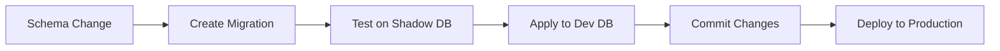

# Schema Migration Guide

## Introduction

This document provides detailed information about the database schema and migration processes for Code Muse Board. We use Prisma as our ORM with PostgreSQL as the primary database.

## Schema Overview

```prisma
// News Articles
model News {
  id          String   @id @default(uuid())
  title       String
  description String
  category    String
  type        NewsType
  timestamp   DateTime @default(now())
  read        Boolean  @default(false)
  summary     String?
  source      String?
  url         String?
  createdAt   DateTime @default(now())
  updatedAt   DateTime @updatedAt
}

// Chat Messages
model ChatMessage {
  id        String   @id @default(uuid())
  content   String
  username  String
  roomId    String
  timestamp DateTime @default(now())
}

// Activity Logging
model ActivityLog {
  id          String      @id @default(uuid())
  action      String
  details     String?
  category    String
  importance  Importance  @default(LOW)
  timestamp   DateTime    @default(now())
}

// Enums
enum NewsType {
  breaking
  alert
  update
}

enum Importance {
  HIGH
  MEDIUM
  LOW
}
```

## Migration Workflow

### 1. Development Process



### 2. Creating Migrations

```bash
# Create and apply new migration
npx prisma migrate dev --name add_new_feature

# Apply existing migrations
npx prisma migrate deploy

# Check migration status
npx prisma migrate status
```

### 3. Migration Safety

- Always test migrations on shadow database
- Use transactions for data migrations
- Back up production data before migrating
- Review migration files before applying

## Working with Models

### News Model Usage

```typescript
// Create news item
const news = await prisma.news.create({
  data: {
    title: "Breaking News",
    description: "Important update",
    category: "Technology",
    type: "breaking"
  }
});

// Query with filtering
const techNews = await prisma.news.findMany({
  where: {
    category: "Technology",
    read: false
  },
  orderBy: {
    timestamp: "desc"
  }
});
```

### Chat Message Operations

```typescript
// Store message
const message = await prisma.chatMessage.create({
  data: {
    content: "Hello!",
    username: "user123",
    roomId: "general"
  }
});

// Get room messages
const messages = await prisma.chatMessage.findMany({
  where: {
    roomId: "general"
  },
  orderBy: {
    timestamp: "desc"
  }
});
```

### Activity Logging

```typescript
// Log activity
const log = await prisma.activityLog.create({
  data: {
    action: "User Login",
    category: "Auth",
    importance: "HIGH"
  }
});

// Query activities
const recentLogs = await prisma.activityLog.findMany({
  where: {
    importance: "HIGH"
  },
  take: 10,
  orderBy: {
    timestamp: "desc"
  }
});
```

## Schema Evolution

### Adding New Fields

1. Update schema.prisma
2. Create migration
3. Update affected queries
4. Deploy changes

Example:
```prisma
model News {
  // ... existing fields ...
  tags String[] // New field
}
```

### Modifying Fields

1. Consider data preservation
2. Create migration
3. Update application code
4. Deploy changes

### Removing Fields

1. Update application code first
2. Create migration
3. Deploy code changes
4. Run migration

## Performance Considerations

### Indexes

Consider adding indexes for:
- ChatMessage.roomId
- News.category
- ActivityLog.importance

### Query Optimization

- Use proper filtering
- Implement pagination
- Select only needed fields
- Use appropriate relations

## Backup and Recovery

### Backup Strategy

1. Regular automated backups
2. Point-in-time recovery
3. Backup verification

### Recovery Process

1. Stop application
2. Restore database
3. Apply migrations
4. Verify data
5. Restart application